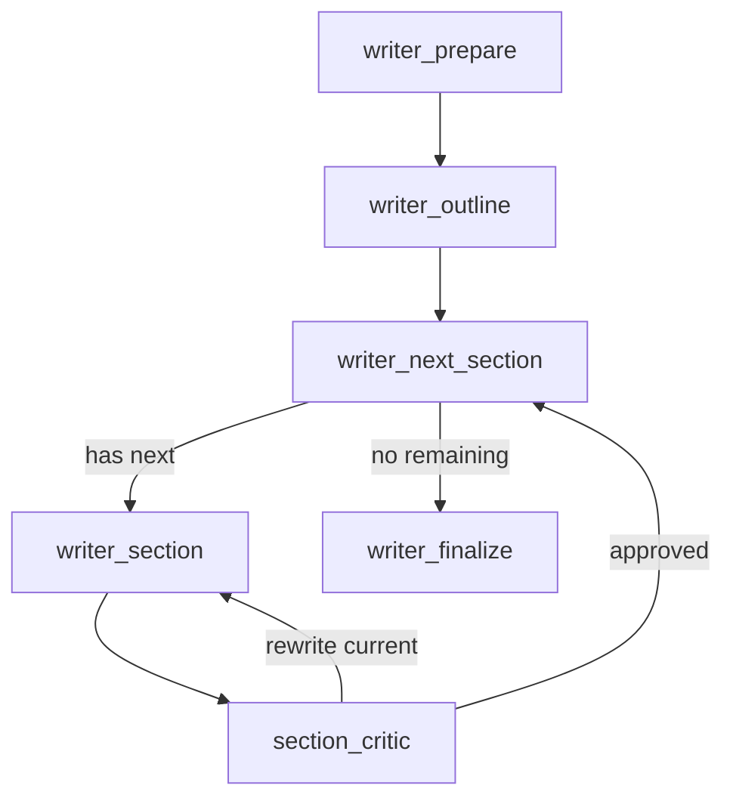

# Writer 质量优先与可恢复改造设计

> 历史设计与开发记录，其中包含尚未全部落地的质量增强目标。旧 8 页缺口、现行 writer 恢复能力与 20 页以上正文验证见 [`README.md`](README.md)。

日期：2026-07-04  
状态：开发方案  
目标：面向华中杯、全国大学生数学建模竞赛等场景，改造 writer，使论文输出质量向优秀论文靠齐，同时解决 writer 节点长时间卡住后无法恢复的问题。

---

## 1. 背景与结论

当前项目的主流程是：

```text
analyst -> modeler -> model_critic -> coder -> sensitivity -> figure_pipeline
-> writer -> paper_critic -> table_assembler -> evaluation -> human_review -> latex
```

当前 `writer_node` 在一个 LangGraph 节点里完成：

```text
outline + 7 个章节 LLM 调用
```

LangGraph 的 checkpoint 只在节点完成后提交。因此只要 writer 内部任意一个章节调用卡住，前面已完成章节也无法恢复，只能从 `figure_pipeline` 后重新跑 writer。

同时，从优秀论文样本读取结果看，目标论文不能只是“完整”，而必须具备竞赛优秀论文的证据密度、分问题递进结构、图表支撑和可复现实验结果。

结论：

```text
writer 改造必须同时解决两件事：
1. 可恢复：每个写作单元完成后都能 checkpoint。
2. 高质量：每个写作单元都受全文蓝图和证据链约束，不能变成松散拼接。
```

---

## 2. 优秀论文样本读取结论

样本读取产物：

- `runs/excellent_paper_analysis/summary.json`
- `runs/excellent_paper_analysis/summary.md`

读取范围：

- 华中杯 2026 A 题：8 篇 PDF，全量纳入。
- 国赛优秀论文：按年份抽样 15 篇。
- 有效文本样本：17 篇。部分国赛 PDF 为扫描版或损坏 PDF，文本不可可靠抽取，不作为 writer 设计证据。

有效样本统计：

| 样本集 | 数量 | 页数中位数 | 页数均值 | 文本字符中位数 |
|---|---:|---:|---:|---:|
| 华中杯 2026 A | 8 | 66 | 81.4 | 115259 |
| 国赛抽样 | 9 | 32 | 33.4 | 31330 |
| 全部有效样本 | 17 | 44 | 56.0 | 40636 |

华中杯 A 题样本特征：

| 指标 | 中位数 | 均值 | 说明 |
|---|---:|---:|---|
| 图出现次数 | 61 | 64.0 | 图表非常密集 |
| 表出现次数 | 60 | 62.1 | 大量结构化结果 |
| 算法出现次数 | 22 | 28.4 | 算法流程是正文核心 |
| 结果出现次数 | 39.5 | 39.8 | 重视定量结果解释 |
| 优化出现次数 | 35 | 42.5 | 强优化问题叙事 |
| 附录出现次数 | 4.5 | 5.1 | 附录通常承载代码/支撑文件 |

典型结构：

```text
摘要
关键词
目录
一、问题重述
二、问题分析
三、模型假设
四、符号说明
五、数据预处理
六、模型建立与求解
  6.1 问题一模型建立与求解
  6.2 问题二模型建立与求解
  6.3 问题三模型建立与求解
七、模型分析检验 / 灵敏度分析 / 误差分析
八、模型评价与推广
参考文献
附录 A 支撑文件列表
附录 B 代码实现
```

写法特征：

- 摘要逐问题展开，不是泛泛总结。
- 每个问题都写清楚：建模对象、目标函数、关键约束、算法、数值结果、结论。
- 问题之间是递进关系：基准模型 -> 新约束/政策模型 -> 动态/鲁棒/扩展模型。
- 数据预处理是独立章节，常包含缺失值处理、异常值处理、聚合、拆分、矩阵重构。
- 建模章节强调变量、目标函数、约束条件和算法流程。
- 求解章节必须有定量结果，不只描述方法。
- 灵敏度/鲁棒性分析是加分项，通常配图表和参数扰动实验。
- 附录不是垃圾桶，应提供支撑文件、关键代码和可复现说明。

---

## 3. 设计原则

### 3.1 质量优先

writer 不能只是文本生成节点，而要成为“竞赛论文写作系统”：

```text
优秀论文范式 -> 全文蓝图 -> 证据链 -> 分节生成 -> 分节审稿 -> 全文审稿
```

### 3.2 每节可恢复

每个写作单元独立成为 LangGraph 可 checkpoint 的节点运行片段。进程卡在当前节时，已完成章节应保留。

### 3.3 不照抄优秀论文

优秀论文只能用于结构范式、证据密度、章节组织和写作风格约束。不得复制正文句子。

### 3.4 证据驱动

所有定量结论必须来自：

- `code_artifacts.stdout`
- `sensitivity_runs`
- `figures`
- `table_assembler`
- `model_versions`

不能让 writer 编造数值。

### 3.5 渐进落地

优先解决核心风险：

1. writer 可恢复。
2. 全文蓝图与章节结构。
3. 分节质量检查。
4. 优秀论文范式库。

---

## 4. 总体架构

改造后的主流程：

```text
analyst
-> modeler
-> model_critic
-> coder
-> sensitivity
-> figure_pipeline
-> paper_blueprint
-> writer_prepare
-> writer_outline
-> writer_next_section
-> writer_section
-> section_critic
-> writer_next_section
   ... loop ...
-> writer_finalize
-> paper_critic
-> table_assembler
-> evaluation
-> human_review
-> latex
```

writer 子流程：



关键收益：

- 每次 `writer_section` 成功后都有 LangGraph checkpoint。
- 每节额外写入 section cache，覆盖“LLM 已返回但 checkpoint 前进程崩溃”的窗口。
- `section_critic` 只重写当前节，避免全篇重写。
- `paper_critic` 仍负责整篇一致性和优秀论文对齐。

---

## 5. 数据模型设计

修改文件：

- `src/math_agent/state.py`

### 5.1 PaperBlueprint

新增：

```python
class SectionPlan(BaseModel):
    name: str
    purpose: str
    required_claims: list[str] = Field(default_factory=list)
    required_evidence: list[str] = Field(default_factory=list)
    target_words: int = 0
    quality_bar: str = ""


class ClaimEvidence(BaseModel):
    claim: str
    section: str
    evidence_type: Literal["model", "stdout", "figure", "table", "sensitivity", "reference"]
    evidence_ref: str
    required: bool = True


class PaperBlueprint(BaseModel):
    title: str = ""
    main_thesis: str = ""
    problem_chain: list[str] = Field(default_factory=list)
    model_progression: list[str] = Field(default_factory=list)
    section_plan: list[SectionPlan] = Field(default_factory=list)
    claim_evidence_map: list[ClaimEvidence] = Field(default_factory=list)
    notation_plan: list[str] = Field(default_factory=list)
    figure_table_plan: list[str] = Field(default_factory=list)
    appendix_plan: list[str] = Field(default_factory=list)
    style_guidance: str = ""
```

用途：

- 统一全文主线。
- 约束各章节写作目标。
- 防止章节独立生成造成风格割裂。
- 给 critic 提供结构化评价对象。

### 5.2 ExcellentPaperProfile

新增：

```python
class ExcellentPaperProfile(BaseModel):
    source: str
    problem_type: str = ""
    section_outline: list[str] = Field(default_factory=list)
    abstract_pattern: str = ""
    model_chain_pattern: str = ""
    evidence_style: str = ""
    figure_table_pattern: str = ""
    appendix_style: str = ""
```

用途：

- 存放优秀论文结构画像。
- 用于 `paper_blueprint_node` 和 writer prompt。
- 不作为正文引用来源。

### 5.3 SectionDraft

新增：

```python
class SectionDraft(BaseModel):
    group: str
    fields: dict[str, str] = Field(default_factory=dict)
    summary: str = ""
    evidence_used: list[str] = Field(default_factory=list)
    status: Literal["draft", "approved", "forced"] = "draft"
    attempt: int = 0
    prompt_hash: str = ""
    critic_issues: list[str] = Field(default_factory=list)
```

用途：

- section cache 的标准格式。
- writer 分节生成的唯一中间产物。
- 便于恢复时由 `writer_finalize_node` 统一合并到 `PaperSections`。

### 5.4 SectionCriticReport

新增：

```python
class SectionCriticReport(BaseModel):
    section: str
    approved: bool
    score: int = 0
    issues: list[str] = Field(default_factory=list)
    rewrite_hint: str = ""
```

用途：

- 分节质量门。
- 不替代 `CriticReport`，只服务 writer 内部循环。

### 5.5 MathModelingState 新增字段

```python
paper_blueprint: PaperBlueprint = Field(default_factory=PaperBlueprint)
excellent_profiles: list[ExcellentPaperProfile] = Field(default_factory=list)

writer_groups_to_run: list[str] = Field(default_factory=list)
writer_completed_groups: list[str] = Field(default_factory=list)
writer_current_group: str = ""
writer_retrieved_context: str = ""
writer_fragments: dict[str, SectionDraft] = Field(default_factory=dict)
writer_section_summaries: dict[str, str] = Field(default_factory=dict)
writer_section_attempts: dict[str, int] = Field(default_factory=dict)
writer_forced_groups: list[str] = Field(default_factory=list)
writer_quality_warnings: list[str] = Field(default_factory=list)
writer_pending_rewrite: bool = False
writer_outline: dict[str, str] = Field(default_factory=dict)
```

注意：

- 这些字段都使用覆盖语义，不使用 `Annotated[..., add]`。
- `writer_section_attempts` 用于避免单节无限重写。
- `writer_fragments` 是拼接最终论文的唯一来源，避免多个 group 写同一个 `PaperSections` 字段时互相覆盖。
- `writer_forced_groups` 记录达到单节重写上限后被放行的章节，供 `paper_critic` 和人工审阅重点检查。
- `writer_pending_rewrite` 表示 `section_critic` 要求当前节重写。

---

## 6. 章节分组设计

当前 writer 的 7 个 group 偏粗：

```text
abstract_problem
assumptions_notation
model
solution
sensitivity
conclusion
references
```

优秀论文对齐后，建议扩展为：

```text
abstract_keywords
problem_restatement
problem_analysis
assumptions_notation
data_preprocessing
model_problem_1
model_problem_2
model_problem_3
sensitivity_robustness
model_evaluation
conclusion
references
appendix_summary
```

映射到 `PaperSections`：

| writer group | PaperSections field | 说明 |
|---|---|---|
| abstract_keywords | abstract, keywords | 摘要和关键词 |
| problem_restatement | problem_restatement | 问题背景与题目重述 |
| problem_analysis | problem_restatement | 追加问题分析小节 |
| assumptions_notation | assumptions, notation | 假设和符号说明 |
| data_preprocessing | model_section | 数据预处理独立小节 |
| model_problem_1 | model_section | 问题一建模与求解 |
| model_problem_2 | model_section | 问题二建模与求解 |
| model_problem_3 | model_section | 问题三建模与求解 |
| sensitivity_robustness | sensitivity | 敏感性、鲁棒性、误差分析 |
| model_evaluation | conclusion | 模型评价与推广 |
| conclusion | conclusion | 结论 |
| references | references | 参考文献 |
| appendix_summary | conclusion | 附录说明，真正附录由模板/latex 渲染 |

### 6.1 多 group 拼接策略

不要让 `writer_section_node` 对 `state.paper.model_section` 做追加式读改写。推荐策略是：

1. `writer_section_node` 只生成当前 group 的 `SectionDraft`。
2. `section_critic_node` 决定该 draft 是 `approved`、`forced`，还是需要重写。
3. `writer_finalize_node` 按固定顺序把所有 `writer_fragments` 拼接成 `PaperSections`。

这样 `model_problem_2` 不需要读取已经含有 `model_problem_1` 的 `paper.model_section`，而是写入：

```python
writer_fragments["model_problem_2"] = SectionDraft(
    group="model_problem_2",
    fields={"model_section": "## 问题二 模型建立与求解\n\n..."},
    status="approved",
)
```

最终由 `writer_finalize_node` 统一执行：

```python
paper.model_section = "\n\n".join(
    fragment.fields["model_section"]
    for group in [
        "data_preprocessing",
        "model_problem_1",
        "model_problem_2",
        "model_problem_3",
    ]
    if (fragment := state.writer_fragments.get(group))
    and fragment.fields.get("model_section")
)
```

选择该方案的原因：

- 可恢复：节点重跑不会把同一节追加两次。
- 可测试：同一组 fragments 必然拼出同一篇 paper。
- 可重写：`section_critic` 拒绝某一节时，只替换该 group 的 fragment。
- 可扩展：`problem_analysis`、`model_evaluation` 等多个 group 共用一个 `PaperSections` 字段时不会互相覆盖。

只有在 Phase 1 继续保持 7 个粗粒度 group，且每个 group 独占一个字段时，才可以临时使用直接写 `state.paper`。一旦进入 13 组结构，应切换到 fragments + finalize。

为了降低一次性改动风险，可以分两步：

1. Phase 1 保持现有 7 组，但让 `model` 和 `solution` 内部按问题一/二/三组织。
2. Phase 2 扩展为 13 组，更接近优秀论文结构。

推荐实际开发采用 Phase 1.5：

```text
先实现 writer 状态机和 section cache；
章节列表仍用现有 writer_sections()；
随后把 writer_sections() 扩展到 13 组。
```

---

## 7. 节点设计

### 7.1 paper_blueprint_node

新增文件：

- `src/math_agent/nodes/paper_blueprint.py`
- `src/math_agent/prompts/paper_blueprint.py`

输入：

- `state.problem`
- `state.questions`
- `state.assumptions`
- `state.model_versions`
- `state.code_artifacts`
- `state.sensitivity_runs`
- `state.figures`
- excellent paper profiles

输出：

```python
{
    "paper_blueprint": PaperBlueprint(...),
    "excellent_profiles": [...]
}
```

核心 prompt 要求：

- 生成整篇论文主线。
- 每个问题明确模型、算法、结果证据。
- 输出图表计划。
- 输出 claim/evidence map。
- 禁止复制优秀论文原句。
- 对照优秀论文结构，但必须服务当前题目。

### 7.2 writer_prepare_node

修改文件：

- `src/math_agent/nodes/writer.py`

职责：

1. 计算本轮要写的 sections。
2. 只做一次 RAG 检索。
3. 准备 writer 状态。
4. 如果是 paper_critic 重写轮，只运行被标记章节。

伪代码：

```python
def writer_prepare_node(state: MathModelingState) -> dict:
    prior_critic = state.latest_critic("paper")
    if state.writer_iteration > 0 and prior_critic and prior_critic.issues:
        groups = _sections_to_rewrite(prior_critic.issues)
    else:
        groups = [g.name for g in writer_sections()]

    ctx = _retrieve_writer_context(state)

    return {
        "writer_groups_to_run": groups,
        "writer_completed_groups": [],
        "writer_current_group": "",
        "writer_retrieved_context": ctx,
        "writer_pending_rewrite": False,
        "writer_section_attempts": {},
    }
```

### 7.3 writer_outline_node

职责：

- 首轮生成全文 outline。
- 重写轮不生成 outline，沿用 `paper_blueprint` 和已有 paper。

输出：

```python
{
    "writer_outline": outline.model_dump()
}
```

### 7.4 writer_next_section_node

职责：

- 从 `writer_groups_to_run` 找第一个未完成 group。
- 写入 `writer_current_group`。
- 如果全部完成，路由到 `writer_finalize`。

伪代码：

```python
def writer_next_section_node(state: MathModelingState) -> dict:
    if state.writer_pending_rewrite and state.writer_current_group:
        return {"writer_current_group": state.writer_current_group}

    for group in state.writer_groups_to_run:
        if group not in state.writer_completed_groups:
            return {"writer_current_group": group}

    return {"writer_current_group": ""}
```

路由函数：

```python
def after_writer_next_section(state: MathModelingState) -> str:
    return "section" if state.writer_current_group else "finalize"
```

### 7.5 writer_section_node

职责：

- 读取 `writer_current_group`。
- 先查 section cache。
- cache 命中则直接恢复 `SectionDraft`。
- cache 未命中则调用 LLM。
- LLM 成功后立即写 cache。
- 写入 `writer_fragments[group]`。
- 不直接改 `state.paper`，尤其不要在这里追加 `paper.model_section`。

cache 路径：

```text
runs/<out>/writer_sections/iter_<writer_iteration>/<group>.json
```

原子写入：

```python
tmp = path.with_suffix(".json.tmp")
tmp.write_text(...)
tmp.replace(path)
```

输出：

```python
{
    "writer_fragments": updated_fragments,
    "writer_section_summaries": updated_summaries,
    "writer_pending_rewrite": False,
}
```

不要在这里更新 `writer_completed_groups`。是否完成由 `section_critic` 决定。

### 7.6 section_critic_node

职责：

- 检查当前章节是否合格。
- 合格则把 group 加入 `writer_completed_groups`。
- 不合格则设置 `writer_pending_rewrite=True`。
- 单节最多重写 N 次，超过后带 warning 放行，避免死循环。

伪代码：

```python
def section_critic_node(state: MathModelingState) -> dict:
    group = state.writer_current_group
    attempts = dict(state.writer_section_attempts)
    attempts[group] = attempts.get(group, 0) + 1

    report = complete(..., schema=SectionCriticReport)

    if report.approved or attempts[group] >= MAX_SECTION_REWRITE_ATTEMPTS:
        status = "approved" if report.approved else "forced"
        return {
            "writer_fragments": _mark_fragment_status(state.writer_fragments, group, status, report),
            "writer_completed_groups": state.writer_completed_groups + [group],
            "writer_section_attempts": attempts,
            "writer_forced_groups": (
                state.writer_forced_groups + [group]
                if status == "forced"
                else state.writer_forced_groups
            ),
            "writer_pending_rewrite": False,
        }

    return {
        "writer_section_attempts": attempts,
        "writer_pending_rewrite": True,
    }
```

### 7.7 writer_finalize_node

职责：

- 按固定顺序把 `writer_fragments` 拼接为 `PaperSections`。
- writer_iteration + 1。
- 清理 current group。
- 保留 `writer_forced_groups` 和 `writer_quality_warnings`，交给 `paper_critic` 做整篇质量判断。

输出：

```python
{
    "paper": assembled_paper,
    "writer_iteration": state.writer_iteration + 1,
    "writer_current_group": "",
    "writer_pending_rewrite": False,
}
```

预算语义：

- `MAX_SECTION_REWRITE_ATTEMPTS` 是单节局部预算。
- `MAX_WRITER_ITERATIONS` 是整篇论文预算。
- 只要 `writer_finalize_node` 成功产出一版完整论文，就消耗 1 次 `writer_iteration`。
- 如果某节达到单节重写上限后被 `forced` 放行，这一版 writer 仍然算一次 `writer_iteration`。
- 如果某节 LLM 调用失败且没有可用 draft，流程停在当前节等待恢复，不进入 `writer_finalize_node`，也不消耗 `writer_iteration`。

这能避免“局部重写失败但整篇预算不消耗”导致的隐性无限循环，同时保留 checkpoint 恢复能力。

---

## 8. Graph 改造

修改文件：

- `src/math_agent/graph.py`

新增 node：

```python
g.add_node("paper_blueprint", _wrap(paper_blueprint_node, "paper_blueprint"))
g.add_node("writer_prepare", _wrap(writer_prepare_node, "writer_prepare"))
g.add_node("writer_outline", _wrap(writer_outline_node, "writer_outline"))
g.add_node("writer_next_section", _wrap(writer_next_section_node, "writer_next_section"))
g.add_node("writer_section", _wrap(writer_section_node, "writer_section"))
g.add_node("section_critic", _wrap(section_critic_node, "section_critic"))
g.add_node("writer_finalize", _wrap(writer_finalize_node, "writer_finalize"))
```

替换边：

```python
g.add_edge("figure_pipeline", "paper_blueprint")
g.add_edge("paper_blueprint", "writer_prepare")
g.add_edge("writer_prepare", "writer_outline")
g.add_edge("writer_outline", "writer_next_section")
g.add_conditional_edges(
    "writer_next_section",
    after_writer_next_section,
    {"section": "writer_section", "finalize": "writer_finalize"},
)
g.add_edge("writer_section", "section_critic")
g.add_conditional_edges(
    "section_critic",
    after_section_critic,
    {"rewrite": "writer_section", "next": "writer_next_section"},
)
g.add_edge("writer_finalize", "paper_critic")
```

修改 paper critic retry：

```python
g.add_conditional_edges(
    "paper_critic",
    after_paper_critic,
    {"retry": "writer_prepare", "advance": "table_assembler"},
)
```

新增路由函数：

- `after_writer_next_section`
- `after_section_critic`

文件：

- `src/math_agent/routing.py`

---

## 9. LLM 超时改造

当前 `llm.complete()` 的硬超时来自模块级 `LLM_TIMEOUT`，无法按调用覆盖。

修改文件：

- `src/math_agent/llm.py`
- `src/math_agent/config.py`

新增配置：

```python
WRITER_SECTION_TIMEOUT = float(os.getenv("MATH_AGENT_WRITER_SECTION_TIMEOUT", "180"))
```

改造 `_do_completion`：

```python
def _do_completion(*, hard_timeout: float | None = None, **kw):
    timeout = hard_timeout or LLM_TIMEOUT
    kw.setdefault("timeout", timeout)
    ...
    t.join(timeout)
    if t.is_alive():
        raise LLMTransportError(f"LLM 调用 {timeout}s 未返回，强制超时")
```

改造 `complete()`：

```python
def complete(..., hard_timeout: float | None = None, **kwargs):
    ...
    raw = _completion_with_retry(..., hard_timeout=hard_timeout)
```

writer section 调用：

```python
complete(..., hard_timeout=WRITER_SECTION_TIMEOUT)
```

收益：

- 单节卡住 180 秒后失败，进程能退出。
- 用户可用 `recover` 从上一节 checkpoint 继续。

---

## 10. CLI 恢复命令

当前 `resume` 主要服务 human_review，会写入 `human_decision`。

新增命令：

```python
@app.command()
def recover(
    out: Path = typer.Option(Path("runs/latest")),
    thread: str = typer.Option("default"),
):
    tracer = Tracer(thread_id=thread, out_dir=out)
    tok = set_current(tracer)
    try:
        with _saver_cm(out) as saver:
            g = build_graph(checkpointer=saver, interrupt_before=["human_review"])
            g.invoke(None, config=_config(thread))
    finally:
        tracer.flush()
        reset_current(tok)
```

使用：

```text
math-agent recover --out runs/phase2_final --thread phase1_e2e
```

语义：

- 不注入 human decision。
- 从任意已有 checkpoint 继续。
- 适合 writer / coder / figure / paper_critic 失败后的恢复。

---

## 11. 优秀论文范式库

### 11.1 目标

从优秀论文中提取结构范式，而不是直接把正文放进 prompt。

新增命令：

```text
math-agent ingest-excellent --src <excellent_paper_dir> --db runs/excellent.sqlite
```

或复用现有 `ingest`，增加参数：

```text
math-agent ingest --src <dir> --db runs/rag.sqlite --source-type excellent_paper
```

### 11.2 提取流程

对每篇 PDF：

1. 提取文本。
2. 识别标题层级。
3. 提取摘要结构。
4. 统计图表密度。
5. 提取章节序列。
6. 生成 `ExcellentPaperProfile`。
7. 入库 `source_type="excellent_paper"`。

### 11.3 检索策略

`paper_blueprint_node` 检索：

- 优先同题型、同领域优秀论文 profile。
- 华中杯/国赛样本作为结构参考。
- 只取 profile，不取长正文。

writer 检索：

- 可以读取 profile 的 `section_outline`、`abstract_pattern`、`evidence_style`。
- 禁止引用或复用原文句子。

---

## 12. Prompt 设计

### 12.1 paper_blueprint prompt

输入：

- 问题文本。
- 模型版本。
- 代码结果摘要。
- 图表摘要。
- 优秀论文 profile。

输出：

```json
{
  "title": "...",
  "main_thesis": "...",
  "problem_chain": [...],
  "model_progression": [...],
  "section_plan": [...],
  "claim_evidence_map": [...],
  "figure_table_plan": [...],
  "appendix_plan": [...],
  "style_guidance": "..."
}
```

硬规则：

- 必须逐问题规划。
- 每个核心结论必须有 evidence。
- 不得产生尚无证据支持的定量结论。
- 摘要必须计划写出关键数值结果。

### 12.2 writer_section prompt

每个 section prompt 必须注入：

- `paper_blueprint`
- 当前 section plan
- `writer_section_summaries`
- prior critic issue
- retrieved context
- code stdout
- figure list
- sensitivity runs
- table warnings

写作规则：

- 当前节只写当前节。
- 必须使用 blueprint 中指定证据。
- 没有证据的数值不得出现。
- 每节结尾生成 2-4 句 summary，供后续章节衔接。

### 12.3 section_critic prompt

检查维度：

- blueprint alignment
- evidence coverage
- no fabricated numbers
- notation consistency
- competition-paper density
- section-specific quality

输出 `SectionCriticReport`。

### 12.4 paper_critic prompt

升级为优秀论文对齐评审。

新增评价维度：

- structure_score
- modeling_depth_score
- evidence_density_score
- result_reproducibility_score
- figure_table_score
- writing_score
- appendix_score

---

## 13. 文件改动清单

| 文件 | 操作 | 说明 |
|---|---|---|
| `src/math_agent/state.py` | 修改 | 新增 blueprint/profile/section critic/writer 状态 |
| `src/math_agent/config.py` | 修改 | 新增 writer section timeout 和 retry 上限 |
| `src/math_agent/llm.py` | 修改 | complete 支持 hard_timeout |
| `src/math_agent/routing.py` | 修改 | 新增 writer loop 路由 |
| `src/math_agent/graph.py` | 修改 | 接入 blueprint + writer 状态机 |
| `src/math_agent/nodes/paper_blueprint.py` | 新增 | 全文蓝图节点 |
| `src/math_agent/prompts/paper_blueprint.py` | 新增 | 蓝图 prompt |
| `src/math_agent/nodes/section_critic.py` | 新增 | 分节质量检查 |
| `src/math_agent/prompts/section_critic.py` | 新增 | 分节 critic prompt |
| `src/math_agent/nodes/writer.py` | 重构 | 大节点拆成状态机节点 |
| `src/math_agent/prompts/writer_section.py` | 修改 | 支持更多 section group 和 blueprint 注入 |
| `src/math_agent/nodes/paper_critic.py` | 修改 | 增强优秀论文对齐评审 |
| `src/math_agent/prompts/paper_critic.py` | 修改 | 增强 prompt |
| `src/math_agent/rag/ingest.py` | 修改 | 支持 excellent_paper/profile 入库 |
| `src/math_agent/cli.py` | 修改 | 新增 recover/ingest-excellent |
| `tests/nodes/test_writer_recoverable.py` | 新增 | writer 状态机测试 |
| `tests/nodes/test_paper_blueprint.py` | 新增 | 蓝图测试 |
| `tests/nodes/test_section_critic.py` | 新增 | 分节 critic 测试 |
| `tests/test_graph_full_smoke.py` | 修改 | graph smoke 路径更新 |
| `tests/test_llm.py` | 修改 | hard_timeout 测试 |

---

## 14. 开发阶段划分

### Phase 1：恢复能力核心改造

目标：

- writer 不再是长事务。
- 每节可 checkpoint。
- 有 section cache。
- 有 recover 命令。

任务：

1. state 增加 writer 进度字段。
2. writer.py 拆成状态机节点。
3. graph.py 接入 writer loop。
4. routing.py 增加 writer loop 路由。
5. 加 section cache。
6. cli.py 增加 recover。
7. llm.py 支持 hard_timeout。

验收：

- 模拟 writer 第 3 节失败，recover 后从第 3 节继续。
- 已完成 section 不重复调用 LLM。
- 单节超时后进程能干净退出。

### Phase 2：全文蓝图与质量约束

目标：

- 写作前生成 `PaperBlueprint`。
- writer section 必须对齐 blueprint。

任务：

1. 新增 PaperBlueprint 等 state 模型。
2. 新增 paper_blueprint_node。
3. writer_section prompt 注入 blueprint。
4. writer 输出 section summary。

验收：

- 蓝图包含 problem_chain、model_progression、claim_evidence_map。
- 每节 prompt 都能看到对应 section_plan。
- paper_critic 能引用 blueprint 进行整体检查。

### Phase 3：分节质量闸门

目标：

- 每节写完即审。
- 局部问题局部重写。

任务：

1. 新增 SectionCriticReport。
2. 新增 section_critic_node。
3. graph 接入 section_critic loop。
4. 增加单节最大重写次数。

验收：

- section_critic 不通过时只重写当前节。
- 达到最大重写次数后放行但记录 warning。
- 不出现无限循环。

### Phase 4：优秀论文范式库

目标：

- 优秀论文进入结构画像库。
- blueprint 可检索范式。

任务：

1. 增加优秀论文 PDF profile 提取工具。
2. 支持 `source_type="excellent_paper"`。
3. `paper_blueprint_node` 检索 profile。
4. prompt 中明确禁止复制原文。

验收：

- 能从本地优秀论文目录生成 profile。
- profile 包含 section_outline、abstract_pattern、evidence_style。
- writer 输出不包含原文长句复制。

### Phase 5：优秀论文对齐评审

目标：

- paper_critic 评价从“是否可用”升级为“是否像优秀论文”。

任务：

1. 扩展 PaperQualityReport 或复用 CriticReport 增加建议维度。
2. paper_critic prompt 注入 blueprint + profile 摘要。
3. issues 能映射回 writer group。

验收：

- paper_critic 能指出“问题分析不足”“数据预处理缺失”“结果无证据”等质量问题。
- 低质量论文不能 approved。
- 局部重写能修复被标记章节。

---

## 15. 测试计划

### 15.1 Unit Tests

`tests/test_state.py`

- `PaperBlueprint` 默认值可序列化。
- `SectionDraft` 能存 group/fields/summary。
- writer 状态字段默认空。

`tests/test_llm.py`

- `complete(..., hard_timeout=2)` 传给 `_do_completion`。
- hard_timeout 生效，不影响默认 LLM_TIMEOUT。

`tests/nodes/test_paper_blueprint.py`

- 蓝图节点调用 complete 并返回 PaperBlueprint。
- profile 为空时也能生成蓝图。

`tests/nodes/test_writer_recoverable.py`

- `writer_prepare_node` 首轮生成全部 groups。
- `writer_prepare_node` 重写轮只生成 critic 标记 groups。
- `writer_next_section_node` 能选择下一个未完成 group。
- `writer_section_node` cache miss 调 LLM 并写 cache。
- `writer_section_node` cache hit 不调 LLM。
- `writer_finalize_node` 只增加一次 writer_iteration。

`tests/nodes/test_section_critic.py`

- approved 时标记 completed。
- rejected 时设置 pending rewrite。
- 超过最大次数后放行并记录 error/warning。

### 15.2 Graph Tests

`tests/test_graph_full_smoke.py`

- 节点顺序包含 paper_blueprint 和 writer loop。
- writer loop 能结束进入 paper_critic。
- human_review interrupt/resume 仍正常。

新增：

- 模拟 writer_section 第 2 次抛 `LLMTransportError`。
- 首次 invoke 失败后 checkpoint 存在。
- recover 后从未完成 section 继续。

### 15.3 Quality Tests

新增 fixture：

- 用小型 fake state 构造一个有模型、有 stdout、有图、有 sensitivity 的竞赛题。

断言：

- blueprint 包含逐问题 chain。
- abstract prompt 包含关键数值必须来自 stdout 的约束。
- section critic prompt 包含优秀论文对齐标准。

---

## 16. 验收标准

### 16.1 恢复能力

- writer 任意 section 卡住或抛错后，不需要重跑已完成 section。
- section cache 能避免重复 LLM 费用。
- `recover` 可从 writer 中间 checkpoint 继续。

### 16.2 论文结构

生成论文必须包含：

- 摘要与关键词。
- 问题重述。
- 问题分析。
- 模型假设。
- 符号说明。
- 数据预处理。
- 分问题建模与求解。
- 敏感性/鲁棒性/误差分析。
- 模型评价与推广。
- 参考文献。
- 附录说明。

### 16.3 证据密度

至少满足：

- 摘要包含每个问题的模型/算法/关键结果。
- 正文每个核心结论对应 evidence。
- 不能出现 stdout/figure/table 中不存在的关键数值。
- 至少有结果对比、敏感性分析、模型评价三类结构化输出。

### 16.4 优秀论文对齐

paper_critic approved 前必须确认：

- 分问题递进清楚。
- 数据预处理不是空白。
- 模型公式和变量说明一致。
- 求解算法有流程和结果。
- 图表被正文解释。
- 结论不是空泛总结。

---

## 17. 风险与取舍

### 风险 1：章节增多导致运行成本上升

缓解：

- Phase 1 先保持 7 组。
- Phase 2 再扩到 13 组。
- section cache 避免重复调用。

### 风险 2：section_critic 引发循环

缓解：

- 每节最大重写次数默认 1 或 2。
- 超过后放行但记录 warning，交给 paper_critic 或 human_review。

### 风险 3：优秀论文检索导致抄袭风险

缓解：

- 只注入 profile，不注入长正文。
- prompt 明确禁止复用原文句子。
- profile 只包含结构和写法摘要。

### 风险 4：state 变大影响 checkpoint

缓解：

- 不把优秀论文正文放进 state。
- cache 文件存 section draft。
- state 只存 profile 摘要和 blueprint。

### 风险 5：一次性改 graph 影响现有测试

缓解：

- 保留旧 `writer_node()` 兼容包装一段时间。
- 新 graph 使用新节点。
- 单元测试先覆盖 writer 状态机，再改 full smoke。

---

## 18. 推荐执行顺序

推荐先做最小闭环：

1. `llm.complete` 支持 `hard_timeout`。
2. writer 状态机 + section cache。
3. `recover` 命令。
4. graph 接入 writer 状态机。
5. paper_blueprint。
6. section_critic。
7. excellent_paper profile ingest。
8. paper_critic 升级。

原因：

- 1-4 直接解决当前 writer 卡住和不可恢复问题。
- 5-8 逐步提升优秀论文质量对齐。
- 不建议先做优秀论文库再做恢复，因为当前 writer 长事务仍会阻塞验证。

---

## 19. 开发 Definition of Done

本方案完成时，应满足：

- `pytest tests/nodes/test_writer_recoverable.py -q` 通过。
- `pytest tests/test_graph_full_smoke.py -q` 通过。
- `pytest tests/test_llm.py -q` 通过。
- 使用 mock LLM 跑完整 graph，能看到 writer section 多个 checkpoint。
- 手动制造 writer section 异常后，`math-agent recover` 能续跑。
- 输出论文结构至少覆盖优秀论文样本中的核心章节。
- paper_critic 对缺少数据预处理、缺少分问题结果、缺少证据支撑的论文会拒绝 approved。

---

## 20. 后续可选增强

可选增强不进入第一轮开发：

- 并行生成独立章节，再由 coherence pass 统一风格。
- 用视觉渲染检查图表位置和页面布局。
- 建立优秀论文结构聚类，按题型自动选择范式。
- 生成“评委视角扣分报告”。
- 增加查重风格检查，降低对优秀论文表达的相似度。

